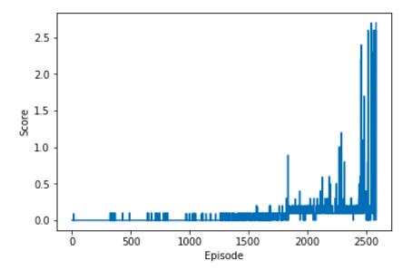

# Project 3 - Collaboration and Competition
## Training multiple DeepRL agents to solve the Unity Tennis task

In this environment, two agents control rackets to bounce a ball over a net. If an agent hits the ball over the net, it receives a reward of +0.1.  If an agent lets a ball hit the ground or hits the ball out of bounds, it receives a reward of -0.01.  Thus, the goal of each agent is to keep the ball in play.

The observation space consists of 8 variables corresponding to the position and velocity of the ball and racket. Each agent receives its own, local observation.  Two continuous actions are available, corresponding to movement toward (or away from) the net, and jumping. 

The task is episodic, and in order to solve the environment, your agents must get an average score of +0.5 (over 100 consecutive episodes, after taking the maximum over both agents). Specifically,

- After each episode, we add up the rewards that each agent received (without discounting), to get a score for each agent. This yields 2 (potentially different) scores. We then take the maximum of these 2 scores.
- This yields a single **score** for each episode.

The environment is considered solved, when the average (over 100 episodes) of those **scores** is at least +0.5.

### Solution
This solution is based on the MADDPG algorithm, using seperate actors and critics for each agents and a shared memory buffer. The code base is adapted from my previous project, which was itself based on the DDPG-Pendulum exercise. The `MultiAgent` class, which is in charge of handling the multiple agents, is not restricted to the case of dueling single agents and should work for more that 2 without any changes.
 The agents solved the task after **3876** episodes. 

#### Hyper Parameters
+ Learning Rate: **0.001**
+ Batch size: **256**
+ Replay Buffer Size: **1e5**
+ Discount Factor: **0.9**
+ Tau: **0.001**
+ The Ornstein-Uhlenbeck noise sigma: **0.1** 

---

### Next Steps
+ Fine tune the parameters
+ Compare performance with shared actors, shared critics, shared actors *and* critics.
+ Implement soccer environment

